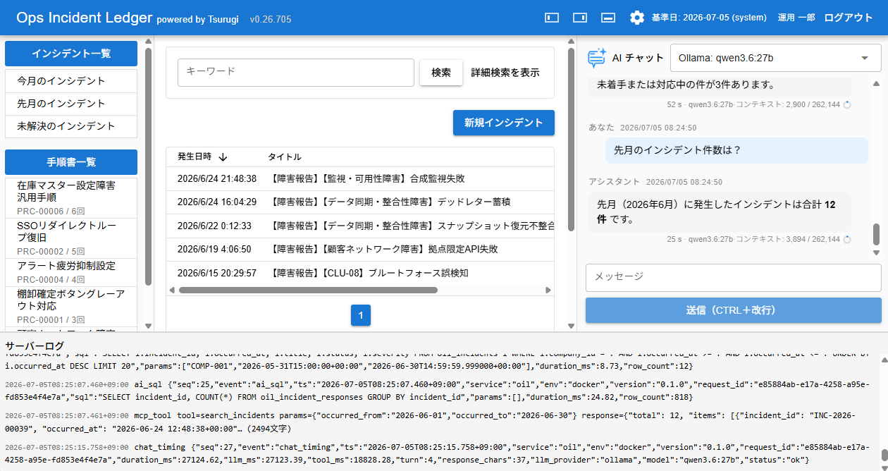

# Ops Incident Ledger (oil)

Ops Incident Ledger — a web tool for operations incident management (powered by Tsurugi).

[日本語](README-ja.md)

FastAPI + Vue/Quasar + Tsurugi + FAISS + LangGraph. Incident management and runbooks (KEDB) with AI-assisted search and triage. **On-prem Ollama** is the default for closed operations networks; cloud OpenAI is optional for faster responses.



## Quick start

Install [Ollama](https://ollama.com/) on the host, then run Docker:

```bash
ollama pull qwen3.6:27b
ollama pull nomic-embed-text
cp .env.example .env
docker compose up --build
```

Open http://localhost:8000/oil/ (`OPENAI_API_KEY` not required).

Default login (evaluation environment):

| Field | Value |
|-------|-------|
| Login ID | `admin` |
| Password | value of `OIL_BOOTSTRAP_PASSWORD` in `.env` (default: `admin`) |

## Features

- Incident ledger with search, filters, and detail views
- Known-error / runbook (procedure) management
- AI chat with RDB search and RAG over incident documents
- Session authentication and role-based access (VIEWER / OPERATOR / ADMIN)

## Requirements

- [Docker](https://docs.docker.com/get-docker/) and Docker Compose v2
- AI (default): Ollama on the host (`qwen3.6:27b`-class LLM + `nomic-embed-text`). Bundled FAISS index uses on-prem embeddings
- AI (optional): OpenAI API key (`OPENAI_API_KEY`) for lower-latency cloud LLM
- Database: [Tsurugi](https://github.com/project-tsurugi/tsurugidb) (included in `docker compose`)

Sample data is fictional (株式会社ストッククラウド). See [data/20260624T221136/README.md](data/20260624T221136/README.md).

## Documentation

| Document | Description |
|----------|-------------|
| [docs/user-manual.md](docs/user-manual.md) | End-user guide (UI operations) |
| [BUILD.md](BUILD.md) | Build and configuration |
| [docs/release-notes.md](docs/release-notes.md) | Release history |

## License

Apache License 2.0. See [LICENSE](LICENSE).

## Security

Report vulnerabilities via [SECURITY.md](SECURITY.md).

## Contributing

This repository is a read-only publication mirror. See [CONTRIBUTING.md](CONTRIBUTING.md).
