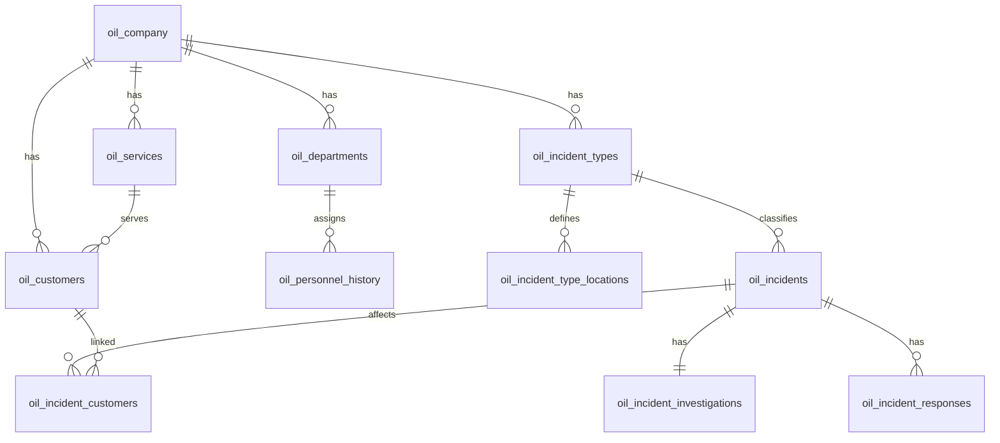

# Ops Incident Ledger ダミーデータセット — COMP-001 / 20260624T221136

架空 SaaS 事業者「株式会社ストッククラウド」のインシデント関連ダミーデータです。Ops Incident Ledger の開発・評価・デモ向けに利用してください。

| 項目 | 値 |
|------|-----|
| 企業 ID | `COMP-001` |
| 実行 ID | `20260624T221136` |
| データ作成日時 | 2026-06-24T22:11:36+09:00 |
| インシデント期間 | 2020-04-01 〜 2026-06-24（Asia/Tokyo） |
| 件数モード | `AUTO`（期間に応じて自動算出） |
| 言語 | 日本語（`ja`） |

---

## 1. データ要件

### 1.1 目的

本データセットは次の用途を想定しています。

- Ops Incident Ledger（運用インシデント台帳）向けクエリ・画面・API の開発
- RAG 検索ツール向け自然文コーパスの評価
- マスターとインシデント履歴の参照整合性を前提とした結合・集計の検証
- 複数年にわたるインシデント履歴の時系列分析・集計の検証

### 1.2 ドメイン前提

| 項目 | 内容 |
|------|------|
| 事業 | 在庫管理 SaaS の提供 |
| 提供サービス | **Mercury**（2020-04 ローンチ、AWS）、**Venus**（2024-08 ローンチ、Azure） |
| 組織 | 運用部・開発部・営業部 |
| 顧客 | テナント 3 社（食品販売 2、服飾販売 1） |
| インシデント種類 | 6 種（在庫登録失敗、棚卸突合、作業ミス、顧客 NW、ストレージ、応答遅延） |

すべて架空の名称・数値です。実在の企業・人物・障害とは無関係です。

### 1.3 品質・整合性

`manifest.json` 上、整合性検証は **合格**（`validation_passed: true`）です。主な制約は次のとおりです。

| 制約 | 内容 |
|------|------|
| ID 一意性 | 同一実行内で文書 ID・インシデント ID は重複しない |
| 名称一致 | 文書内の固有名詞（企業名・サービス名・人名・部署名）は `master.json` と一致 |
| インシデント構成 | 各インシデントに障害報告 1 件・調査 1 件・対応 1 件以上（`INC-2026-00039` のみ調査文書なし） |
| 一次対応 | 各インシデントに `INITIAL` 対応が 1 件含まれる |
| 発生日 | インシデント期間（2020-04-01 〜 2026-06-24）内 |
| 検知経路 | 運用監視（`OPS_MONITORING`）→ 運用部、営業問い合わせ（`SALES_INQUIRY`）→ 営業部 |

### 1.4 データ量（本セット）

| 区分 | 件数 |
|------|------|
| インシデント | 818 |
| 文書（JSONL 合計） | 2,841 |
| 　├ 障害報告（`incident_report`） | 818 |
| 　├ 調査（`investigation`） | 817 |
| 　└ 対応（`response`） | 1,206（インシデントあたり 1〜2 件、平均約 1.5 件） |

重要度の内訳: `LOW` 302 / `MEDIUM` 304 / `HIGH` 193 / `CRITICAL` 19  
検知経路の内訳: `OPS_MONITORING` 513 / `SALES_INQUIRY` 305  
対応種別の内訳: `INITIAL` 818 / `PERMANENT` 388

発生年の内訳: 2020 年 327 / 2021 年 55 / 2022 年 45 / 2023 年 60 / 2024 年 210 / 2025 年 77 / 2026 年 44

### 1.5 利用上の注意

- **二系統の成果物**を含みます。用途に応じて使い分けてください（後述「ファイル構成」参照）。
- `setup.sql` の一部列（`detected_at`、`status`、対応の `started_at` / `ended_at` など）は、コーパスから **導出した値** です。厳密な時系列再現が必要な場合は `corpus.jsonl` の `metadata.occurred_at` を正としてください。
- Tsurugi 向け DDL には **外部キー制約は含みません**（Tsurugi 非対応のため）。参照関係は論理的なものとしてアプリケーション側で扱ってください。
- 複数 ID を 1 列に格納する場合は **セミコロン区切り**（`;`）です（例: `SVC-001;SVC-002`）。
- 本セットは `20260623T160542`（短期・304 件）より期間が長く件数が多い **長期版** です。ローンチ直後の集中発生（2020 年）に加え、Venus ローンチ後（2024 年以降）のインシデントも含みます。

---

## 2. 内容の概要

### 2.1 シナリオ

**株式会社ストッククラウド** は、小規模小売事業者向けの在庫管理 SaaS を提供しています。

- **Mercury**: 2020 年 4 月ローンチ。AWS 上で稼働。ローンチ直後（2020 年）に障害が多発する期間を想定したデータ分布（327 件）。
- **Venus**: 2024 年 8 月ローンチ。Azure 上で稼働。2024 年以降は Mercury と Venus の両サービスがインシデント対象（2024 年 210 件、2025 年 77 件、2026 年 44 件）。
- **顧客**: Mercury 利用 2 社、Venus 利用 1 社。インシデントに顧客が紐づくのは 314 件（`oil_incident_customers` は 466 行、複数顧客紐づけあり）。
- **外部イベント**: 本セットでは 0 件（`external_events` テーブルは空）。

### 2.2 インシデント種類一覧

| type_id | 種類名 | デフォルト重要度 | 検知経路 | 代表発生個所 |
|---------|--------|------------------|----------|--------------|
| ITYP-001 | マスター設定ミスによる在庫登録失敗 | MEDIUM | OPS_MONITORING | Mercury AWS AP |
| ITYP-002 | 棚卸突合失敗 | LOW | SALES_INQUIRY | 顧客店舗POS |
| ITYP-003 | 運用者の作業ミスによるアクセス障害 | HIGH | OPS_MONITORING | 運用コンソール |
| ITYP-004 | 顧客側ネットワーク障害 | LOW | SALES_INQUIRY | 顧客拠点NW |
| ITYP-005 | ストレージ溢れ | HIGH | OPS_MONITORING | Mercury AWS Storage |
| ITYP-006 | 利用者増による応答遅延 | MEDIUM | OPS_MONITORING | Venus Azure AP |

### 2.3 文書（コーパス）の種別

各インシデントは、原則として次の文書セットを持ちます。

| doc_type | 内容 | 件数（本セット） |
|----------|------|------------------|
| `incident_report` | 発生事象の報告（障害報告） | 818 |
| `investigation` | 原因分析・調査結果 | 817 |
| `response` | 一次〜恒久対応ログ | 1,206 |

文書本文（`text`）は自然文の日本語です。RAG のインデックス対象として設計されています。検索評価用に `metadata.tags` や `pattern_id` / `cluster_id` などの分類情報も付与されています（100 パターン中 99 種類が使用）。

---

## 3. データ構造

### 3.1 ファイル構成

```
20260624T221136/
  README.md              # 本書
  master.json            # マスターデータ（企業・組織・サービス・顧客・種類）
  corpus.jsonl           # RAG 向け文書コーパス（1 行 1 文書、UTF-8 LF）
  setup.sql              # Tsurugi 向け DDL + DML（テーブル接頭辞 oil_）
  manifest.json          # 件数サマリ・検証結果
  generation_config.json # インシデント対象期間などの設定値（参照用）
```

| ファイル | 主な利用先 |
|----------|-----------|
| `setup.sql` | Tsurugi 等リレーショナル DB への投入 |
| `corpus.jsonl` | ベクトル検索・RAG パイプライン |
| `master.json` | マスター参照・名称解決・JOIN キーの確認 |

### 3.2 エンティティ関係



### 3.3 Tsurugi テーブル（`setup.sql`）

全テーブル名に接頭辞 **`oil_`** を付与しています。

#### マスター

| テーブル | 説明 | 本セットの行数 |
|----------|------|----------------|
| `oil_company` | 架空 SaaS 提供者 | 1 |
| `oil_departments` | 部署 | 3 |
| `oil_department_history` | 部署変更履歴 | 0 |
| `oil_personnel_history` | 人事履歴（従業員・所属） | 2 |
| `oil_services` | 提供サービス | 2 |
| `oil_customers` | テナント（顧客） | 3 |
| `oil_external_events` | 外部イベント | 0 |
| `oil_incident_types` | インシデント種類 | 6 |
| `oil_incident_type_locations` | 種類別発生個所 | 6 |

#### トランザクション（インシデント）

| テーブル | 説明 | 本セットの行数 |
|----------|------|----------------|
| `oil_incidents` | インシデント本体 | 818 |
| `oil_incident_investigations` | 調査結果（1:1） | 817 |
| `oil_incident_responses` | 対応ログ（1:n） | 1,206 |
| `oil_incident_customers` | 影響顧客（多対多） | 466 |

#### 投入順序

外部キー制約はありませんが、参照整合性のため次の順序での投入を推奨します。

1. `oil_company`
2. `oil_departments`
3. `oil_department_history`
4. `oil_personnel_history`
5. `oil_services`
6. `oil_customers`
7. `oil_external_events`
8. `oil_incident_types`
9. `oil_incident_type_locations`
10. `oil_incidents`
11. `oil_incident_customers`
12. `oil_incident_investigations`
13. `oil_incident_responses`

`setup.sql` は上記順序で DML が並んでいます。

### 3.4 ID 採番規則

| エンティティ | 形式 | 例 |
|-------------|------|-----|
| 企業 | `COMP-{3桁}` | `COMP-001` |
| 部署 | `DEPT-{識別子}` | `DEPT-OPS` |
| 従業員 | `EMP-{5桁}` | `EMP-00001` |
| サービス | `SVC-{3桁}` | `SVC-001` |
| 顧客 | `CUST-{4桁}` | `CUST-0001` |
| インシデント種類 | `ITYP-{3桁}` | `ITYP-001` |
| インシデント | `INC-{YYYY}-{5桁}` | `INC-2020-00001` |
| 調査 | `INV-{5桁}` | `INV-00001` |
| 対応 | `RSP-{5桁}` | `RSP-00001` |
| 文書 | `DOC-{種別}-{5桁}` | `DOC-INC-00001` |

インシデント ID の `{YYYY}` は発生年と一致します。

### 3.5 列挙型の許容値

| 項目 | 値 |
|------|-----|
| 重要度（`severity`） | `CRITICAL`, `HIGH`, `MEDIUM`, `LOW` |
| インシデント状態（`status`、DB のみ） | 本セットはすべて `RESOLVED` |
| 検知経路（`detection_source`） | `OPS_MONITORING`, `SALES_INQUIRY` |
| 対応種別（`response_type`） | `INITIAL`, `SECONDARY`, `TERTIARY`, `PERMANENT` |
| サービス状態（`status`） | `PLANNED`, `ACTIVE`, `DEPRECATED`, `RETIRED` |
| 顧客業種（`industry_segment`） | `FOOD_RETAIL`, `APPAREL_RETAIL` |
| 人事変更（`change_type`） | `JOIN`, `TRANSFER`, `PROMOTION`, `LEAVE` |

### 3.6 `master.json` 構造

```json
{
  "company": { "company_id", "company_name", "industry" },
  "departments": [ { "department_id", "department_name", "parent_department_id", "valid_from", "valid_to" } ],
  "department_history": [ { "history_id", "department_id", "change_type", "effective_at", "description" } ],
  "personnel_history": [ { "history_id", "employee_id", "employee_name", "department_id", "role_title", "change_type", "effective_at" } ],
  "services": [ { "service_id", "service_name", "description", "launch_at", "owner_department_id", "status", "cloud_platform", "incident_rate_multiplier", "frequency_phases" } ],
  "customers": [ { "customer_id", "customer_name", "industry_segment", "service_id", "contract_start_at" } ],
  "external_events": [ { "event_id", "event_name", "event_type", "start_at", "end_at", "description", "related_service_ids" } ],
  "incident_types": [ { "type_id", "type_name", "frequency_weight", "avg_detection_minutes", "severity_default", "detection_source", "description" } ],
  "incident_type_locations": [ { "type_id", "location_name" } ]
}
```

`frequency_phases` はマスター定義用のメタ情報です。`setup.sql` には展開されません。

### 3.7 `corpus.jsonl` レコード構造

1 行が 1 文書。UTF-8（BOM なし）、改行 LF。

| フィールド | 型 | 説明 |
|-----------|-----|------|
| `id` | string | 文書 ID（`DOC-INC-*` / `DOC-INV-*` / `DOC-RSP-*`） |
| `doc_type` | string | `incident_report` / `investigation` / `response` |
| `company_id` | string | 企業 ID |
| `incident_id` | string | インシデント ID |
| `title` | string | 文書タイトル |
| `text` | string | 本文（自然文） |
| `metadata` | object | フィルタ・評価用属性（下表） |
| `references` | object | 内部 ID 参照（下表） |

**metadata（共通）**

| フィールド | 説明 |
|-----------|------|
| `locale`, `company_name`, `generated_at` | 言語・企業名・コーパス作成日時 |
| `occurred_at` | インシデント発生日時 |
| `severity` | 重要度 |
| `incident_type_name`, `location_name` | 種類名・発生個所 |
| `service_names`, `department_names`, `employee_names` | 関連名称（配列） |
| `customer_names`, `industry_segments` | 関連顧客・業種（配列） |
| `detection_source` | 検知経路 |
| `pattern_id`, `cluster_id`, `cluster_name` | シナリオパターン分類 |
| `tags` | 検索評価用タグ |

**metadata（`response` のみ）**: `response_type`, `sequence_no`

**references**

| フィールド | 説明 |
|-----------|------|
| `type_id` | インシデント種類 ID |
| `service_ids`, `department_ids`, `employee_ids`, `customer_ids` | 関連 ID（配列） |
| `related_event_id` | 外部イベント ID（任意） |
| `response_id` | 対応 ID（`response` のみ） |

### 3.8 コーパスと DB の対応

| corpus.jsonl | Tsurugi テーブル | 備考 |
|--------------|-----------------|------|
| `doc_type: incident_report` | `oil_incidents` | `description` ← `text`、`title` はそのまま |
| `doc_type: investigation` | `oil_incident_investigations` | `investigation_detail` ← `text` |
| `doc_type: response` | `oil_incident_responses` | `detail` ← `text`、`response_id` ← `references.response_id` |
| `references.customer_ids` | `oil_incident_customers` | 0 件以上 |
| `master.json` 各配列 | 対応する `oil_*` マスターテーブル | `setup.sql` DML に反映済み |

**DB のみ存在する列（導出値）**

| 列 | 導出方法 |
|----|----------|
| `oil_incidents.detected_at` | `occurred_at` + 種類マスターの `avg_detection_minutes` |
| `oil_incidents.status` | 固定値 `RESOLVED` |
| `oil_incident_investigations.completed_at` | `detected_at` + 24 時間 |
| `oil_incident_responses.started_at` / `ended_at` | `detected_at` からの相対時刻 |
| `oil_incident_investigations.root_cause_summary` | 調査文書 `text` の先頭 200 文字 |

RAG 開発では `corpus.jsonl` を、リレーショナルな参照・集計では `setup.sql`（または `master.json`）を正とすることを推奨します。

---

## 4. クイックスタート

### Tsurugi への投入

```sql
-- setup.sql を Tsurugi SQL クライアントで実行
```

### コーパスの読み込み（例）

```python
import json
from pathlib import Path

records = [
    json.loads(line)
    for line in Path("corpus.jsonl").read_text(encoding="utf-8").splitlines()
    if line.strip()
]
```

### 代表的な JOIN 例（論理参照）

```sql
-- インシデントと種類名
SELECT i.incident_id, t.type_name, i.severity, i.occurred_at
FROM oil_incidents i
JOIN oil_incident_types t ON i.type_id = t.type_id;

-- インシデントと対応履歴
SELECT i.incident_id, r.response_type, r.sequence_no, r.summary
FROM oil_incidents i
JOIN oil_incident_responses r ON i.incident_id = r.incident_id
ORDER BY i.incident_id, r.sequence_no;

-- 発生年別の件数集計
SELECT SUBSTRING(i.incident_id FROM 5 FOR 4) AS year, COUNT(*) AS cnt
FROM oil_incidents i
GROUP BY year
ORDER BY year;
```
