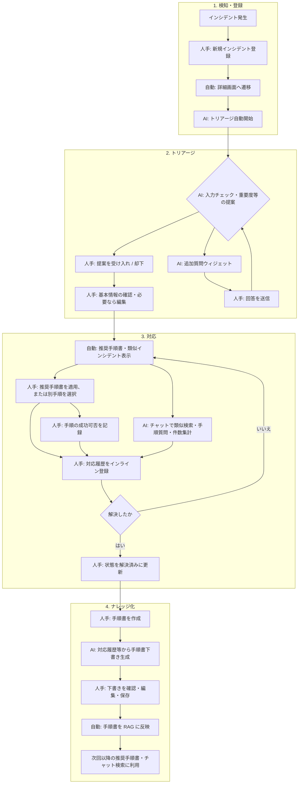

# 利用者マニュアル

版番号: 1.8

本書は Ops Incident Ledger の画面操作を説明する。

アプリケーションのベース URL は `/oil/` である（評価環境では `http://localhost:8000/oil/`）。

本システムでは **ログイン（セッション認証）** を使用する。

## 1. 画面構成

| 領域 | 説明 |
|------|------|
| ヘッダ | タイトル、**ログインユーザの表示名**、基準日、クイックフィルタ・AIチャット・サーバーログの表示切替。認証有効時は **ログアウト**。ADMIN / OPERATOR は **設定（歯車）** メニューからマスター・ユーザ・Webhook API キー・通知チャネルへ |
| 左サイドバー | インシデントのクイックフィルタ（今月 / 先月 / 未解決 / **インシデント一覧** / **手順書一覧**）、その下に **使用回数 Top5** の対応手順書（見出し: 手順書一覧） |
| 中央 | インシデントまたは対応手順書の一覧・詳細・編集画面 |
| 右 | AI チャット（左端をドラッグして幅を変更可能） |
| 下部 | LLM 処理ログ（高さ 30vh） |

ヘッダのトグルで左サイドバー・チャット・ログを個別に表示/非表示できる。サーバに接続できない場合、ヘッダが警告色になり「サーバに接続できません」と表示される。

### 1.1 左サイドバー

- **クイックフィルタ** … クリックすると中央にインシデント一覧が表示され、条件が上書きされる
- **使用回数 Top5** … 有効な手順書のうち利用回数が多い順に 5 件。クリックで手順書詳細を開く

### 1.2 狭い画面（モバイル幅）

左サイドバーと AI チャットは通常非表示となる。ヘッダ左の **メニュー** アイコンで左サイドバーを、**チャット** アイコンで AI チャットをドロワー表示する。ログパネルはヘッダの **ログ** ボタンで切り替える。

## 2. 業務フロー（インシデント対応の流れ）

インシデント発生から手順書化までの標準的な流れと、**どの作業で AI が支援するか**を示す。AI は判断の代替ではなく、検索・下書き・入力補助を担う。最終的な登録・適用・状態変更は運用者が画面で行う。

### 2.1 凡例

| 区分 | 意味 | 画面・機能での例 |
|------|------|------------------|
| **人手** | 運用者が入力・判断・保存する | インシデント登録、対応履歴の記録、手順書の適用、状態を解決済みに変更 |
| **AI** | エージェント（LLM）＋ RDB 検索 / RAG が支援する | トリアージ提案、類似インシデント・推奨手順書、チャット質問応答、手順書下書き |
| **自動** | 保存をきっかけにシステムが行う（AI 本体の対話以外） | 詳細画面での推奨手順書・類似インシデントの読込、RAG インデックス更新 |

### 2.2 全体フロー

### 2.3 フェーズ別の作業と AI の役割

#### 1. 検知・登録

| 作業 | 担当 | 内容 |
|------|------|------|
| 障害・事象の把握 | 人手 | 監視アラート、ユーザー申告等（本システム外） |
| インシデント新規登録 | 人手 | 発生日時、タイトル、説明、影響顧客・サービス等を入力して保存（§5.1） |
| 詳細画面への遷移 | 自動 | 保存後に詳細を表示 |
| 初動トリアージの開始 | AI | チャットへトリアージ用メッセージが自動送信される（§7.3） |

#### 2. トリアージ（初動整理）

| 作業 | 担当 | 内容 |
|------|------|------|
| 重要度・種類・発生個所の見直し | AI → 人手 | AI が **変更提案カード** を提示。運用者が **受け入れる** / **却下**（§7.3） |
| 不足情報のヒアリング | AI → 人手 | チャット内の入力ウィジェット（ラジオ、日時等）で回答 |
| 手動での修正 | 人手 | 提案に載らない項目は **編集** 画面で直接修正 |
| 類似手順の早期確認（任意） | AI | 編集画面でタイトル・説明入力中、**類似手順書** が表示されることがある（§5.2） |

#### 3. 対応（調査・復旧）

| 作業 | 担当 | 内容 |
|------|------|------|
| 推奨手順書の提示 | 自動（RAG） | 詳細を開くと類似度・成功率付きで表示。更新アイコンで再取得（§4） |
| 類似インシデントの提示 | 自動（RAG） | 過去事例と対応サマリーを表示（§4） |
| 手順書の適用 | 人手 | 推奨カードの **適用**、または一覧・Top5 から選択（§6.4） |
| 状況確認・検索質問 | AI | チャットで「類似インシデントを探す」、件数集計、手順書検索（RDB ツール / RAG ツール）（§7） |
| 対応の記録 | 人手 | 詳細画面の **対応履歴** にインラインで追記（§4） |
| 手順の効果記録 | 人手 | 紐づけ手順書の **成功** を「はい / いいえ」で記録（§6.4） |
| 状態の更新 | 人手 | **編集** で `対応中` → `解決済み` 等に変更 |

対応中は **推奨手順書・類似インシデントの再表示** と **チャット** を繰り返し使いながら、対応履歴を蓄積する。

#### 4. ナレッジ化（手順書作成）

| 作業 | 担当 | 内容 |
|------|------|------|
| 手順書作成の開始 | 人手 | 状態が **解決済み** のとき、詳細の **手順書を作成**（§4） |
| 下書き生成 | AI | インシデント内容・対応履歴をもとに Markdown 下書きをフォームへ投入（§6.3） |
| レビュー・保存 | 人手 | 問題説明・手順・注意事項を確認・修正して **保存** |
| インデックス更新 | 自動 | 保存後、手順書が RAG に取り込まれ、以降の推奨・チャット検索に反映 |

手順書をインシデントと結びつけずに新規作成する場合は、§6.1 の **新規手順書** から人手で登録する（AI 下書きは付かない）。

### 2.4 AI を使うタイミング（早見表）

| やりたいこと | 使う機能 | AI の種類 |
|--------------|----------|-----------|
| 登録直後に重要度などを整理したい | 自動トリアージ（チャット） | 対話＋変更提案 |
| 似た過去事例を知りたい | 詳細の類似インシデント / チャット「類似を探す」 | RAG |
| 今の障害に合う手順を探したい | 詳細の推奨手順書 / チャットで手順質問 | RAG |
| 件数や一覧を自然文で聞きたい | AI チャット（例: 未完了×顧客 NW） | RDB 検索ツール |
| 解決後にマニュアル化したい | **手順書を作成** → 編集画面 | 下書き生成 |
| Slack に障害を通知したい | 通知チャネル設定（§14）／AI チャットで通知依頼（OPERATOR 以上） | 自動 POST / ツール |
| 入力中に似た手順がないか見たい | インシデント編集の類似手順書パネル | RAG |

## 3. インシデント一覧

初期表示は、基準日に基づく **過去 1 カ月** の未完了（未着手・対応中）インシデント。

| 操作 | 説明 |
|------|------|
| 行クリック | 詳細画面へ遷移。そのインシデントが AI チャットのコンテキストになる |
| 発生日時ソート | 列ヘッダで昇順・降順を切り替え |
| キーワード検索 | タイトル等を部分一致で検索（サーバ側 RDB 検索） |
| RAG 検索 | チェックボックス ON 時、キーワードを自然文として意味検索（タイトルに含まれなくてもヒットしうる） |
| 詳細検索 | 発生日範囲、状態、**重要度**、種類を指定 |
| 新規インシデント | 右上ボタンから新規登録画面へ |
| 左サイドバー | 今月 / 先月 / 未解決のクイックフィルタ、インシデント一覧・手順書一覧への遷移 |

## 4. インシデント詳細

画面を開くと、推奨手順書・類似インシデントは自動的に読み込まれる（更新アイコンで再取得可能）。

| セクション | 内容 |
|------------|------|
| 基本情報 | 発生日時、状態、重要度、種類、影響顧客・サービス、説明など |
| 調査 | 調査内容がある場合のみ表示 |
| 推奨手順書 | 類似度・成功率付きカード。**詳細** で手順書を開く。**適用** で当該インシデントに紐付け |
| 類似インシデント | 類似度、状態、適用した手順書 ID、対応サマリー。クリックでそのインシデント詳細へ |
| 紐づけ手順書 | 適用済み手順書一覧。**成功** 欄で「はい / いいえ / 未入力」を選択して記録。**解除** で誤適用を取り消せる |
| 対応履歴 | インラインで新規追加・編集（保存時の競合は §12） |

上部ボタン:

| ボタン | 動作 |
|--------|------|
| 編集 | インシデント編集画面へ |
| 類似インシデントを探す | AI チャットを開き、類似インシデント検索の質問を送信 |
| 手順書を作成 | 状態が **解決済み** のときのみ有効。インシデント内容をもとにした手順書の下書き編集画面へ |

## 5. インシデントの新規登録・編集

### 5.1 新規登録

| 項目 | 操作の要点 |
|------|------------|
| 発生日時 | 初期値は **ブラウザの現在日時** |
| 検出者・検出部署 | 従業員・部署マスタから選択。**新規時の初期値はログインユーザとその所属部署** |
| 発生個所 | 自由入力。**ダブルクリック**で、選択中の「種類」に紐づく候補から選択 |
| 影響顧客・影響サービス | 複数選択可 |
| 保存 | 詳細画面へ遷移し、AI チャットで **トリアージが自動開始** |

### 5.2 編集

既存インシデントを変更して保存する。保存後は詳細画面へ戻る（新規時のような自動トリアージは行わない）。

**検出者**・**検出部署**もマスタから変更できる。タイトル・説明を入力すると、**類似手順書** が折りたたみパネルに表示されることがある（一定文字数以上、入力後しばらく待つ）。

他ユーザが先に同じインシデントを保存していた場合、**更新の競合**ダイアログが表示される（§12）。

## 6. 対応手順書

### 6.1 手順書一覧へのアクセス

グローバルメニューはない。次のいずれかで開く。

- ブラウザのアドレスバーに `/oil/procedures` を入力
- 左サイドバー Top5、インシデント詳細のリンク、AI チャット内の `PRC-*` リンクから詳細を経由

一覧ではキーワード・種類・有効/無効・タグで検索できる。**RAG 検索（意味検索）** チェックボックスを ON にすると、キーワードを自然文として類似手順書を検索できる（キーワード入力が必須）。表の列ヘッダで **使用回数** や **更新日時** のソートが可能。**新規手順書** ボタンから空の登録画面を開く。

### 6.2 手順書詳細

| 項目 | 説明 |
|------|------|
| 本文 | 問題説明・対応手順・注意事項・必要機材（Markdown 表示） |
| 統計 | 使用回数、成功率 |
| 元インシデント | ある場合はリンクでインシデント詳細へ |
| 有効トグル | 詳細画面上部で有効/無効を切り替え（無効手順書は推奨・Top5 の対象外） |
| 適用インシデント | この手順書を使ったインシデント一覧 |

### 6.3 手順書の登録・編集

Markdown で問題説明・手順・注意事項等を入力し **保存** する。保存時に他ユーザとの競合があれば §12 のダイアログが表示される。

インシデント詳細の **手順書を作成** から開いた場合、対応履歴等をもとにした下書きがフォームに入った状態で表示される。内容を確認・編集してから保存する。

### 6.4 インシデントとの連携

| 操作 | 手順 |
|------|------|
| 手順書を適用 | インシデント詳細の推奨手順書カードで **適用** |
| 成功可否の記録 | 紐づけ手順書の **成功** プルダウンで「はい / いいえ」を選ぶ（未入力のままも可） |
| 解決済みから手順書化 | **手順書を作成** → 編集 → 保存 |

## 7. AI チャット

### 7.1 基本操作

- ヘッダで AI チャットを表示する
- 上部プルダウンで **LLM モデル** を選択（未選択時はサーバ既定）
- メッセージを入力し **送信**（Ctrl＋Enter でも可）
- 入力欄を **ダブルクリック** すると、よく使う質問メニューが開く
- ストリーミング中は **中断** で受信を打ち切れる
- 応答末尾に **応答時間（秒）** と **モデル名** が表示される
- 応答内の `INC-2020-00001` および `PRC-00001` 形式の ID はリンク（クリックで詳細を開く）

手順書に関する質問例:「在庫マスター障害で使える手順書を教えて」「このインシデントに似た過去の対処手順は？」

OPERATOR 以上は、チャットで「`INC-2020-00001` を Slack に通知して」等と依頼すると、AI が `send_incident_notification` ツールで通知チャネルへ送信する（§14 でチャネルを事前登録すること）。

### 7.2 コンテキストインシデント

一覧で行を選択した状態、または詳細画面を表示しているとき、そのインシデント ID がチャットに渡される。短い質問でも AI が対象インシデントを把握できる。

### 7.3 AI トリアージ

インシデントの初動確認（入力チェック・重要度の見直しなど）を AI チャットで行う。

#### 開始方法

| きっかけ | 動作 |
|----------|------|
| 新規インシデント保存直後 | 詳細画面へ遷移し、トリアージ開始メッセージが自動送信される |
| 既存インシデント | 詳細を開いたうえで、チャットに「トリアージして」等と依頼する |

#### 変更提案カード

AI がフィールド変更を提案すると、チャット内に **提案カード** が表示される。

- **現在値** / **提案値** / 理由を表示
- **受け入れる** … サーバへ保存され、詳細画面が更新される
- **却下** … 提案を破棄（DB は変更しない）

主な提案対象: 重要度、検知日時、種類、発生個所。

#### 入力ウィジェット

AI が追加情報を求めるとき、文字列入力・ラジオ・チェックボックス・日時入力 UI が表示されることがある。入力後 **送信** すると次の AI ターンへ渡る。

#### 注意（プロダクト）

- すべての提案がカード表示されるとは限らない
- 発生日時・影響サービス・影響顧客の自動提案は限定的
- 初動時点で不明な項目は、聞き取りまたはスキップしてよい

## 8. ログパネル

- ヘッダのトグルで下部の LLM 処理ログを表示する
- チャット、ツール呼び出し、RAG 等のログが 2〜3 秒間隔で追記される
- 行を **ダブルクリック** すると JSON の raw / 整形表示を切り替えられる

## 9. ログインと権限

### 9.1 ログイン

`auth.enabled: true` の環境では、未ログインで保護された画面にアクセスすると **`/oil/login`** へ誘導される。

| 項目 | 説明 |
|------|------|
| ログイン ID | 管理者から付与された `login_name` |
| パスワード | 初回は管理者が設定したパスワード（投入後は速やかに変更すること） |
| ログアウト | ヘッダの **ログアウト** ボタン |

ログインに連続して失敗すると、しばらくログインが制限される（レートリミット）。

### 9.2 ロール

| ロール | できること（概要） |
|--------|-------------------|
| **VIEWER** | 一覧・詳細・手順書の参照、**AI チャット**（保存・登録系は不可） |
| **OPERATOR** | VIEWER の参照に加え、インシデント・対応・手順書の登録・編集、**通知チャネル**管理 |
| **ADMIN** | OPERATOR に加え、**マスター管理**・**ユーザ管理**・**Webhook API キー**管理 |

複数ロールが付与されている場合、権限は和集合となる（例: ADMIN + OPERATOR）。

VIEWER で保存ボタンを押した場合など、権限不足はサーバが拒否し、エラー通知が表示される。

## 10. マスター管理（ADMIN）

ヘッダの **設定（歯車）** → **マスター**、または `/oil/masters` で開く。ADMIN ロールのみアクセス可能。

タブで次の 6 種類を切り替える。

| タブ | 内容 |
|------|------|
| インシデント種類 | 種類名、平均検知時間、デフォルト重要度、検知元 |
| 発生個所 | 種類ごとの発生個所候補（種類を選択してから一覧・編集） |
| 顧客 | 顧客名、業種区分 |
| サービス | サービス名、説明 |
| 部署 | 部署 ID、部署名 |
| 従業員 | 氏名、所属部署（新規登録で人事履歴を追加） |

| 操作 | 説明 |
|------|------|
| 新規 | ダイアログで項目を入力して保存 |
| 行クリック | 既存行の編集ダイアログ |
| 再読込 | サーバから一覧を再取得 |

マスターの削除 API はない。インシデント編集フォームの選択肢（種類・顧客・検出者等）は、ここで登録した内容が反映される。

保存時に他 ADMIN が先に更新していた場合、§12 の競合ダイアログが表示される。

## 11. ユーザ管理（ADMIN）

ヘッダの **設定（歯車）** → **ユーザ**、または `/oil/admin/users` で開く。

| 操作 | 説明 |
|------|------|
| 新規ユーザ | 従業員、ログイン ID、初期パスワード、ロールを指定 |
| 行クリック | 有効/無効、パスワード変更、ロール変更 |
| 再読込 | 一覧を再取得 |

ロールは **管理者（ADMIN）** / **オペレータ（OPERATOR）** / **閲覧者（VIEWER）** から複数選択できる。

## 12. 同時編集（楽観ロック）

インシデント・対応・手順書・マスター・ユーザなどを **保存** するとき、画面を開いた時点より他ユーザが先に更新していた場合、サーバは保存を拒否し **更新の競合** ダイアログが表示される。

| ボタン | 動作 |
|--------|------|
| **最新を読み込む** | サーバ上の最新内容を再取得し、フォームを上書きする（推奨） |
| **キャンセル** | ダイアログを閉じ、編集内容はそのまま（そのまま再保存しても競合は解消しない） |

上書き保存（force）は提供しない。最新を読み込んだうえで必要な修正を行い、再度保存する。

## 13. Webhook API キー（ADMIN）

外部システムが oil にインシデントを自動登録するための API キーを管理する。ヘッダの **設定（歯車）** → **Webhook API キー**、または `/oil/admin/webhook-api-keys` で開く。**ADMIN** ロールのみアクセス可能。

| 操作 | 説明 |
|------|------|
| 新規生成 | 名称と操作者（従業員）を指定してキーを発行。表示された **平文キーは再表示できない** のでコピーして外部システムへ渡す |
| 行クリック | 名称・操作者・有効フラグを編集 |
| 再読込 | 一覧を再取得 |

発行したキーは HTTP ヘッダ `X-API-Key` に付与し、`POST /oil/api/webhooks/incidents` へ送信する。Webhook URL や API キーは第三者に漏らさないこと。

## 14. 通知チャネル（OPERATOR 以上）

インシデント種類ごとに Slack Incoming Webhook 通知先を登録する。ヘッダの **設定（歯車）** → **通知チャネル**、または `/oil/notification-channels` で開く。**OPERATOR** 以上がアクセス可能。

| 項目 | 説明 |
|------|------|
| 名称 | 管理用の表示名 |
| Slack Incoming Webhook URL | Slack 側で発行した Webhook URL |
| 対象インシデント種類 | 1 チャネルに複数種類を紐づけ可能 |
| 有効 | 無効にすると自動通知・AI ツール送信の対象外 |

| 操作 | 説明 |
|------|------|
| 新規チャネル | ダイアログで項目を入力して保存 |
| 行クリック | 既存チャネルの編集。Webhook URL の変更もここで行う |
| 削除 | 編集ダイアログから削除 |

**自動通知**: 対象種類のインシデントが **新規作成** されたとき（Web UI 保存・受信 Webhook 共通）、有効チャネルへ Slack メッセージが非同期 POST される。通知失敗でもインシデント登録は取り消されない。

**手動通知**: OPERATOR 以上は AI チャットでインシデント ID を指定して再送を依頼できる（§7.1）。

## 15. Slack Bot（Slack 利用者向け）

oil に Slack Bot が接続されている環境では、Slack チャンネルで Bot を **メンション** してインシデントに関する質問ができる。Web UI の AI チャットと同様に RDB 検索・RAG 検索で回答するが、**1 メンション＝1 回の質問** であり、スレッド内の過去メッセージは文脈として使わない。

| できること | 例 |
|------------|-----|
| 件数・一覧の質問 | 「今月の未解決インシデントは何件？」 |
| 類似事例・手順の検索 | 「在庫マスター障害の過去事例を教えて」 |
| 特定 ID の参照 | 本文に `INC-2020-00001` を含めて詳細を質問 |

| できないこと | 動作 |
|--------------|------|
| インシデントの新規登録・更新 | 「登録して」「状態を解決済みにして」等は拒否メッセージを返す |
| トリアージ提案の受け入れ | Web UI 専用（Slack からは参照のみ） |

Bot の利用には管理者による Slack アプリ設定が必要である。

## 変更履歴

| 版 | 日付 | 変更内容 |
|----|------|----------|
| 1.0 | 2026-06-26 | 初版（業務フロー、インシデント、手順書、AI チャット） |
| 1.3 | 2026-06-28 | 左ペイン Top5、手順書連携 |
| 1.4 | 2026-06-28 | RFC005: ログイン、ロール、マスター/ユーザ管理、検出者選択、楽観ロック |
| 1.5 | 2026-06-29 | 製品名を Ops Incident Ledger（サブタイトル powered by Tsurugi）に変更 |
| 1.6 | 2026-07-02 | RFC007: 一覧 RAG 検索チェックボックス、サーバ検索の説明 |
| 1.7 | 2026-07-03 | RFC008: Webhook API キー、通知チャネル、Slack Bot 利用、チャットからの手動通知 |
| 1.8 | 2026-07-04 | プロトタイプ表記をプロダクトに統一 |
